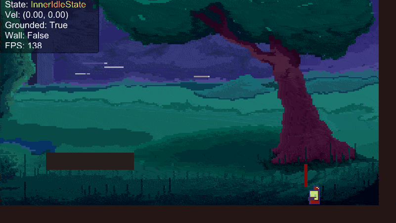

<<<<<<< HEAD
# Angry Birds Refactor (Project Name)

## 游戏演示 / Gameplay


## 简介 / Introduction

这里是你的项目简介...
=======
# 🗡️ Project Dash (2D 动作平台跳跃游戏)

> 本项目是由个人独立开发的 Unity 2D 动作平台跳跃 Demo，主要用于底层逻辑架构与游戏手感调优的实践。

## 🎮 游戏实机演示 (Game Demo)


## 🛠️ 技术栈 (Tech Stack)
*   **游戏引擎：** Unity 2022.x (2D URP)
*   **编程语言：** C#
*   **物理与表现：** Rigidbody2D, TrailRenderer, UGUI

## ✨ 核心特性与架构 (Core Features & Architecture)

### 1. 有限状态机 (FSM) 角色控制
摒弃了臃肿的 `if-else` 面条代码，采用**接口+类**的形式实现了独立的内部状态机。
*   已实现状态：`Idle`, `Move`, `Jump`, `Fall`, `Dash`, `WallSlide`, `WallJump`。
*   优势：严格遵循开闭原则与单一职责，状态间逻辑彻底解耦，极大地提升了新技能扩展的安全性与可读性。

### 2. 硬核平台跳跃手感调优
深度拆解《蔚蓝》等经典平台跳跃游戏手感，在代码层面实现了以下机制：
*   **土狼时间 (Coyote Time)：** 离开平台边缘后的短暂时间内仍允许起跳，提升玩家容错率。
*   **跳跃预输入 (Jump Buffering)：** 落地前提前按下跳跃键，落地后会自动立刻起跳。
*   **动态重力缩放：** 上升时重力较小（轻盈），下落时重力倍增（扎实）。

### 3. 对象池 (Object Pool) 性能优化
针对高频触发的**冲刺残影**与**落地扬尘**粒子特效，自主实现了 `Queue` 队列对象池模块。
*   将高频的 `Instantiate/Destroy` 转化为 `SetActive(true/false)` 的循环复用。
*   实现了资源的 O(1) 复杂度存取，从源头上切断了堆内存碎片的产生，避免了 GC (垃圾回收) 导致的主线程掉帧卡顿。

### 4. 渲染与物理表现
*   规范化 `Sorting Layer` 解决 2D 渲染穿模问题。
*   基于多摄像机实现动态视差背景 (Parallax Scrolling) 效果。

*   -----
>>>>>>> 8928ef1b224621b652d034e998b7e667f81c4279
### 2026.01.26 开发日志：敌人程序化动画
**功能名称：** Q版史莱姆弹性动画 (Procedural Squash & Stretch)
**核心目的：** 解决白模美术表现力不足的问题，通过代码实现物理质感的动态反馈，提升游戏“生命力”。
####  技术实现要点：
1.  **正弦驱动 (Sine Wave)**
    *   **原理：** 利用 `Mathf.Sin(Time.time * frequency)` 生成一个在 -1 到 1 之间连续波动的信号。
    *   **应用：** 用这个信号作为形变的“驱动力”，控制缩放的幅度。
2.  **体积守恒 (Volume Preservation)**
    *   **物理直觉：** 当物体被拉长（Y轴变大）时，必须变细（X轴变小），反之亦然。
    *   **公式逻辑：** `Scale.y = 1 + factor`，`Scale.x = 1 - factor`。
3.  **平滑过渡 (Smooth Transition)**
    *   **问题：** 当敌人停止移动时，Sin 波形可能正处于形变状态，直接归零会造成画面跳变。
    *   **解决：** 使用 `Vector3.Lerp` 进行插值。
    *   **代码应用：**
        ```csharp
        // 每一帧让当前 Scale 向目标 Scale (1,1,1) 靠近 10%
        // Time.deltaTime * speed 决定了归位的快慢
        transform.localScale = Vector3.Lerp(transform.localScale, targetScale, Time.deltaTime * 5f);
        ```
#### 📺 效果展示：
*(此处插入你的视频/GIF)*


Lerp 在 Update 里用： 产生减速缓冲效果（适合相机、UI）。
MoveTowards 在 Update 里用： 产生匀速效果（适合子弹、电梯）
